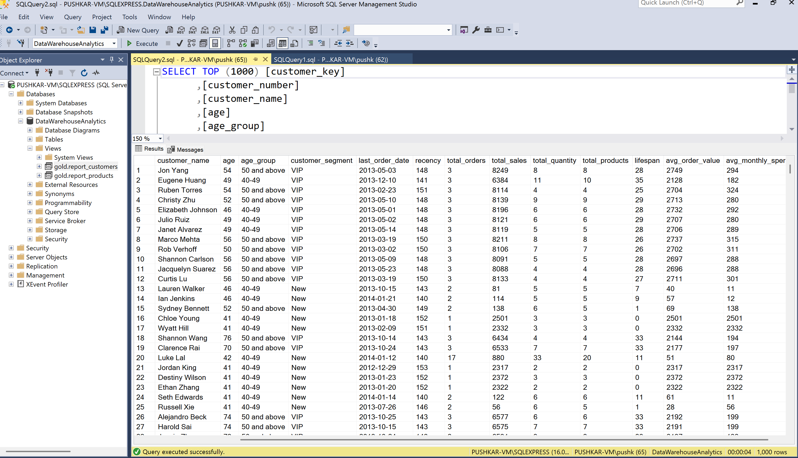
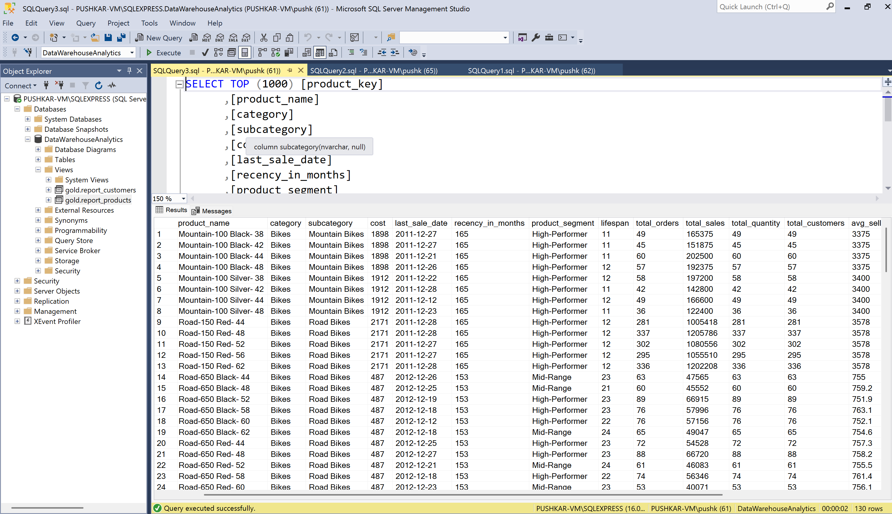

# Advanced SQL Analytics Project

## 📌 Overview
This project demonstrates how SQL can be used as a **complete analytics tool** — from raw data exploration to advanced analysis and final business reporting.  

The workflow covers:
- **EDA (Exploratory Data Analysis)**  
- **ADA (Advanced Data Analytics)**  
- **Data transformations**  
- Final **analytical reports** for **Customers** and **Products**

---

## 📂 Project Structure

- 📁 **datasets/** – Raw datasets used for analysis  
- 📁 **sql_scripts/** – SQL scripts for EDA, ADA, and transformations  
- 📁 **assets/** – Report screenshots (Customer & Product)  
- 📄 **README.md** – Project documentation  

---

## 🔍 Methodology

1. **Exploratory Data Analysis (EDA)**  
   - Profiled datasets, identified missing values, duplicates, and outliers.  
   - Summarized sales distributions, seasonal trends, and customer/product activity.  

2. **Advanced Data Analytics (ADA)**  
   - Implemented window functions (running totals, rankings, moving averages).  
   - Created cumulative sales, period-over-period (MoM/YoY) comparisons, and segmentation.  
   - Built customer and product performance metrics.  

3. **Transformations & Reports**  
   - Cleaned and standardized data using modular SQL scripts.  
   - Built two **final SQL views**:
     - **Customer Report View** – customer-level KPIs (revenue, order frequency, trends).  
     - **Product Report View** – product-level KPIs (sales volume, revenue trends, rankings).  

---

## 📊 Final Reports

### 🧑‍🤝‍🧑 Customer Report

### 📦 Product Report

